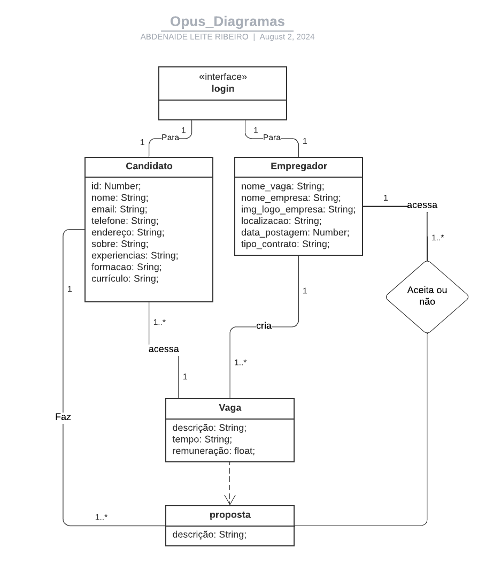

# Representação Arquitetural
Esta seção apresenta os diagramas utilizados para facilitar o entendimento das etapas e interações com o site. 

### Visão de Caso de Uso:
Este diagrama de caso de uso demonstra as interações entre os usuários (atores) e o sistema, destacando os requisitos funcionais. Ele auxilia na identificação dos atores, na especificação dos casos de uso (funcionalidades), facilita a comunicação entre os stakeholders e contribui para o planejamento do desenvolvimento do sistema. Seus componentes principais incluem atores, casos de uso, associações e relações de inclusão/extensão, proporcionando uma visão clara das funcionalidades do sistema e de suas interações.

    

### Visão Lógica:

Este diagrama de visão lógica demonstra a estrutura organizacional dos elementos de um sistema, destacando seus componentes e as relações entre eles. Ele auxilia na compreensão da arquitetura do sistema, especifica os módulos e suas interações. Seus componentes principais incluem classes, interfaces, pacotes e suas inter-relações, proporcionando uma visão clara da organização lógica do sistema e de suas interdependências.

    

### Visão de Processos:

Este diagrama de visão de processos demonstra o fluxo de atividades e a interação entre processos em um sistema, destacando a sequência e a lógica das operações. Ele auxilia na compreensão da dinâmica do sistema, especifica os processos e suas interações, e contribui para o planejamento do desenvolvimento do sistema. Seus componentes principais incluem atividades, eventos, gateways e fluxos de sequência, proporcionando uma visão clara dos processos do sistema e suas interações.

    

### Visão de Rotas da API:

Este diagrama de rotas de API ilustra o fluxo de comunicação entre os diferentes endpoints de um sistema, destacando as interações e a troca de dados entre os serviços. Ele facilita a compreensão da estrutura da API, especifica os métodos de requisição, os parâmetros utilizados, e as respostas esperadas, contribuindo para o planejamento e desenvolvimento do sistema. Seus componentes principais incluem endpoints, métodos HTTP, parâmetros de entrada e saída, e códigos de status, proporcionando uma visão clara das rotas da API e suas interações.

    

<!-- ### Visão de Implementação: -->